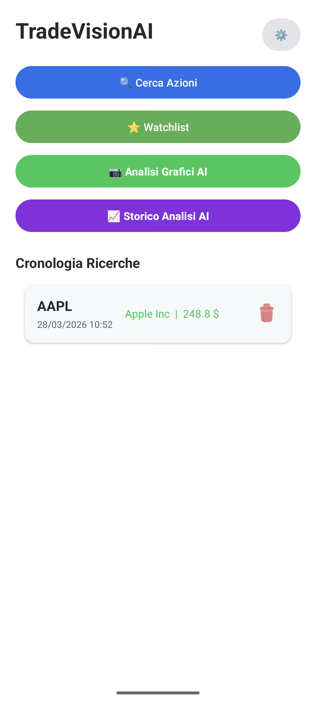
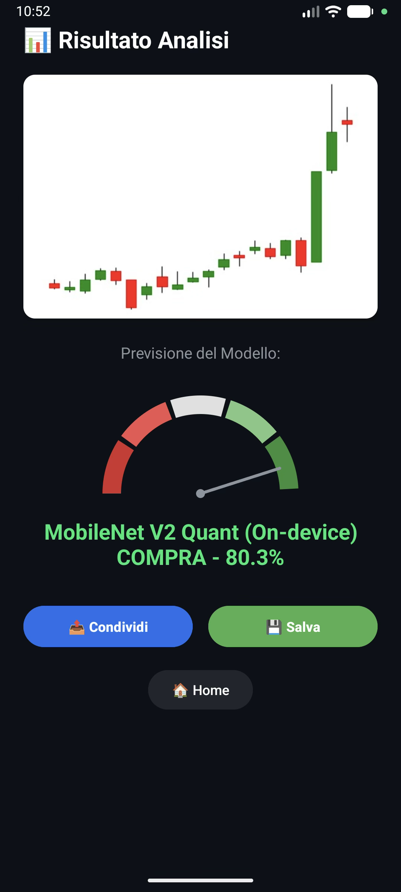
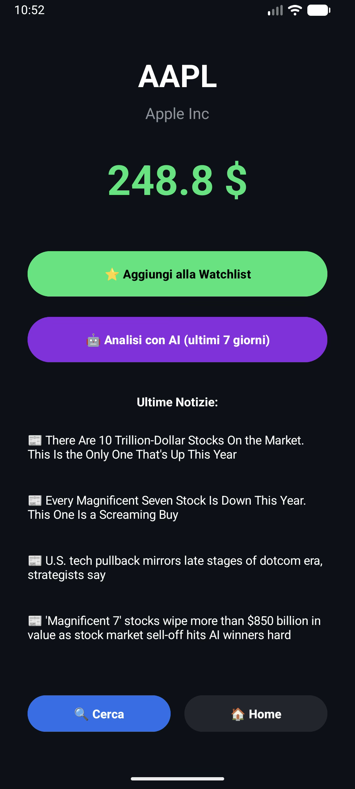
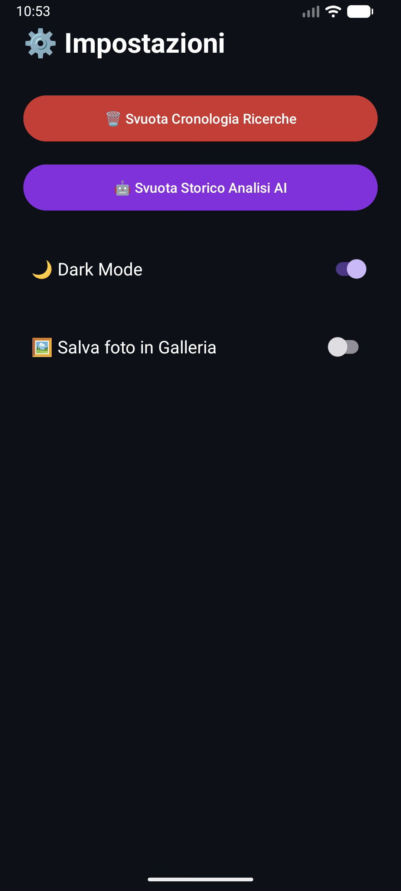

# TradeVision AI

**TradeVision AI** is an Android application with integrated AI, designed to analyze financial market charts and provide instant trend predictions (Bullish/Bearish).

The project leverages a hybrid architecture: it runs lightweight models directly on the device (**Edge AI**) for instant offline analysis, and relies on a scalable cloud server (**Cloud AI on AWS**) for high-precision inference using deep neural networks.

## Screenshots

<div align="center">
  
  
  
  
</div>

*(Note: Depending on your markdown viewer, you can also use standard image tags like ``)*

-----

## Main Features

  * **Image Capture:** Take photos of charts in real-time or upload them from the device's gallery.
  * **Hybrid Inference (Edge & Cloud):**
      * **Local (TFLite):** Offline, zero-latency execution directly on the device.
      * **Cloud (AWS/FastAPI):** High-precision processing using Keras models.
  * **Dynamic Model Selection:** Choose between *MobileNet V2 (Local)*, *MobileNet V3 Small (Local)*, *Inception V3 (Cloud)*, and *MobileNet V2 (Cloud)* directly from the interface.
  * **Analysis History:** Automatic local saving of past analyses (images and predictions) for quick offline reference.
  * **API Security:** Communication between the app and the server is protected by encrypted API Keys.

-----

## Tech Stack

### Frontend (Android)

  * **Language:** Kotlin
  * **Main Libraries:**
      * `TensorFlow Lite` / `LiteRT` (Edge Inference)
      * `OkHttp3` (Synchronous and asynchronous REST API calls)
      * `Coroutines` (Background thread management)
      * `Gson` & `SharedPreferences` (Local database for history)
      * `RecyclerView` (Dynamic UI for history)

### Backend (Cloud / AWS)

  * **Language:** Python 3.10
  * **API Framework:** FastAPI + Uvicorn
  * **Machine Learning:** TensorFlow 2.x / Keras (Multi-model loading)
  * **Infrastructure:** Docker, Docker Compose, AWS EC2 (Ubuntu)

-----

## Backend Architecture

The Cloud server is containerized with **Docker** and handles the simultaneous loading of multiple models into RAM at startup. It uses *Monkey Patching* and Keras' `custom_object_scope` to ensure backward compatibility with Data Augmentation layers and custom mathematical operations (`TrueDivide`, `GetItem`) of Keras 3.

**Main Endpoint:**
`POST /predict?model_id={id}`

  * **Headers:** `X-API-KEY`
  * **Body:** Image encoded as `multipart/form-data`
  * **Response:**
    ```json
    {
        "model_used": "inception",
        "prediction": "BUY",
        "confidence": 98.45
    }
    ```

-----

## Installation Guide

### 1\. Backend Configuration (Docker)

1.  Clone the repository on your server.
2.  Place the trained models (generated via notebooks in the `AI_TRAINING` folder) into the backend root directory.
3.  Set your secret key in the `docker-compose.yml` file:
    ```yaml
    environment:
      - API_KEY_SECRET=API
    ```
4.  Start the container:
    ```bash
    docker-compose build --no-cache
    docker-compose up -d
    ```

### 2\. Frontend Configuration (Android Studio)

1.  Open the project in Android Studio.
2.  Place your TFLite files inside the `app/src/main/assets/` folder.
3.  In the `local.properties` file, insert the required fields:
    ```properties
    FINNHUB_API_KEY=""
    AWS_API_URL="http://IP:30080"
    AWS_API_KEY=""
    ```
4.  Build and run the app on an emulator or a physical device.

-----

## Author

Developed by **Matteo Battilori** as a project for the `Mobile Programming` course.